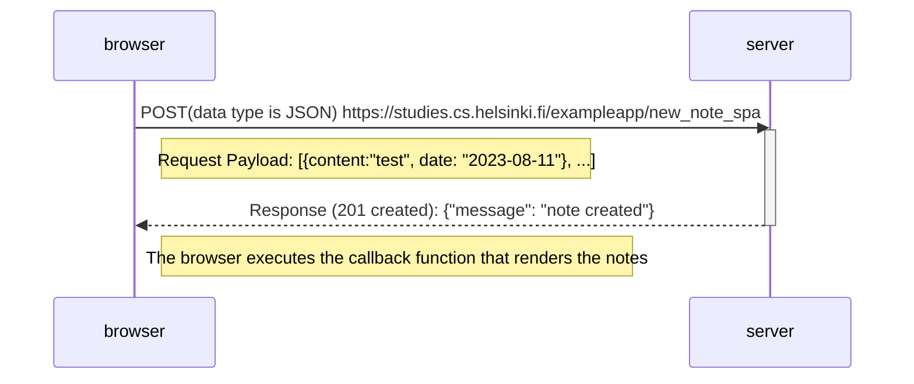

```mermaid
sequenceDiagram
    participant browser
    participant server

    browser->>server: POST(data type is JSON) https://studies.cs.helsinki.fi/exampleapp/new_note_spa
    activate server
    Note right of browser:Request Payload: [{content:"test", date: "2023-08-11"}, ...]
    server-->>browser: Response (201 created): {"message": "note created"}
    deactivate server

    Note right of browser: The browser executes the callback function that renders the notes
```
